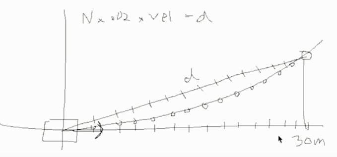

# CarND-Path-Planning-Project
Self-Driving Car Engineer Nanodegree Program
   
### Goals
In this project the goal is to safely navigate around a virtual highway with other traffic that is driving +-10 MPH of the 50 MPH speed limit. Ego car's localization and sensor fusion data will be provided, there is also a sparse map list of waypoints around the highway. The car should try to go as close as possible to the 50 MPH speed limit, which means passing slower traffic when possible, note that other cars will try to change lanes too. The car should avoid hitting other cars at all cost as well as driving inside of the marked road lanes at all times, unless going from one lane to another. The car should be able to make one complete loop around the 6946m highway. Since the car is trying to go 50 MPH, it should take a little over 5 minutes to complete 1 loop. Also the car should not experience total acceleration over 10 m/s^2 and jerk that is greater than 50 m/s^3.

### Path planning project implementation phases:
Below steps are followed to incrementally finish the project.
1. Write code as if there's only one lane and ego car is the only car. Plan ahead to stay within this lane (only s is involved), ignore jerk etc. violations. There'll for sure be accidents to run into car ahead in the same lane. 
2. Stay within ego lane, avoid hit car in front within same lane. Control delta(s) steps by control reference speed.
3. Stay within ego lane, follow previous car and control jerks etc. to avoid violation of speed/jerk etc. constraints. Mainly use spline.h to fitting curve, taking advantage of waypoints from previously generated trajectory.
4. Process fusion data of other cars, planning simple lane change (left/fast lane takes priority vs. right lane).
5. Final touch on misc: more sophiscated lane change planning (details below), safety considerations (ego speed vs. empty lane buffer of target lane when changing lane) etc. 

### Implementation details

#### Spline fitting trajectory

Use simple spline.h fitting to generate trajectory, experiments to set certain parameters achieved jerk-free implementations. 

Every round of calculation (20ms gap) generates 50 NEW waypoints. Depending on how many waypoints from previous round are left, only (50-remaining old waypoints) NEW waypoints will be posted to simulator though.

To minimizing jerk, for simplicity implementation no JMT is used here, last 3 waypoints (if avail) from previous paths are used, then adding three more "long shot" points ahead in s (s+30, s+60, s+90), a total of 6 points are used as anchor points for spline fitting. These waypoints are acquired in global X,Y coordinates, for conveniences, we first convert them to car coordinates that origin point sits at the last waypoint from last round. After all waypoints generated done, they are converted back to global coordindates before posting to simulator. 

Using of waypoints from previous path guarantees smooth transition at boundary as the latency between program and simulator is inherent. BTW, I tried to only use last 2 waypoints from previous path, jerks will occasionally witnessed in verification runs. Using last 3 waypoints resolved that.

Another heuristic method involved to minimize jerk is to evenly divide the Euclidean distance between 50 new points as below diagram shows (curtersy to Udacity Q&A video session on this project). It is not accurate math method to track jerk, but it works and simple enough.



#### Lane change control

Specifically, closest distance of car in front of ego lane is monitored:
```
                // Other vehicle in current ego lane
                if (d<(2+4*lane+2) && d>(2+4*lane-2) )
                {
                    // Check collision with the car_in_lane
                    if ((other_car_s>car_s) && ((other_car_s-car_s)<30))
                    {
                        too_close = true;
                        close_dist = other_car_s-car_s;
                    }
                }
```
##### When to consider lane change?
Only all below are met:
1. Initial start up is done. Startup process doesn't consider lane change, just follow lane until mph > certain threshold.
2. Current speed is slower than 45mph and close enough to car in front - it must be held back by some slow car ahead in lane keep state.
3. Not too close to car in front. This is to avoid collision in case car in front is suddenly slowing down.
4. Ego speed is not slower than 35 mph. Save reason as 3, to avoid collision by other fast cars from behind when in lane change.
5. Not considering lane change again when in a lane change process. 
```
            if (car_speed<45.0 && && car_speed>35 
                 && close_dist<30.0 && close_dist>10.0 
                 && startup_done )
                
                // Only change lane when previous lane change completed.
                // Please be noticed that condition is a bit stricter (only if car sits around lane center).
                bool lane_change_completed = car_d<(2+4*target_lane+1) && car_d>(2+4*target_lane-1);

            ...
```

##### Left/right lane change preference
In fusion data processing step, these variables are recorded.
```
            // closest cars in different lanes - initialized with large number to be overwritten.
            double left_fwd_closest = 5000;
            double left_bwd_closest = 5000;
            double right_fwd_closest = 5000;
            double right_bwd_closest = 5000;
```
Simultaneously considering both sides when margins ahead/behind are above thresholds (30 meters ahead, 20 meters behind). Threshold numbers are from experiments and heuristics.
```
                    bool turn_left=false;
                    bool turn_right=false;

                    if (lane>0 && left_fwd_closest>30 && left_bwd_closest>20) // left lane avail
                        turn_left = true;
                    if (lane<2 && right_fwd_closest>30 && right_bwd_closest>20) // right lane avail
                        turn_right = true;
```
When both sides are avail, which ever gives bigger margin ahead wins. 

#### Speed control
Below code controls reference speed:
```
            // Speed adjustment - 0.4 delta translates to ~3m/s^2 acceleration in simulator
            
            // Slow down faster when closer
            if (too_close)
                ref_v -= min(0.8, 10.0/close_dist); 
            // Speed up to get close to speed limit
            else if (ref_v < 49.5) 
                ref_v += 0.5;
                
            // Slowing down until stop in emergency, 
            // even at cost of system overloading incident. 
            // E.g. sudden braking of car ahead 
            if (close_dist < 5.0) 
                ref_v -= 1.0;
                
            // Under-flow protection
            if (ref_v<0.0)  
                ref_v = 0.0;
```
##### Crazily abrupt braking
I did recorded crazy braking of car ahead of me. My code to deal with sudden brake works (45s), however, at the cost of overloading system incident.

<iframe width="560" height="315" src="https://www.youtube.com/embed/xZyyLK_BOTs" frameborder="0" allowfullscreen></iframe>


### Reflections and Improvement opportunities
1. Use JMT (jerk minimum trajectory) to generate trajectory. I've implemented this function in main.cpp, however, it requires tracking of s', s'' and d', d'' -- a lot of efforts. Since simple spline fitting works, this idea was abandoned for schedule reason.
2. Need reimplement GetXY() and getFrenet() functions that seem not provide high accuracy output -- a certain segments of curve lane on the map is of special suspect of low precision, whenever car passes there, high chance of running close to lane edges and swizzling spline curve witnessed too.
3. FSM for more sophisticated control on behavior. The idea gave in for schedule reason too as current scheme works fine for ~30 mins w/o incidents. Corner cases such as the sudden brake shown above need more sophisticated controls (FSM).
4. Cost function to take into account time spent/speed. 

---------------------------------------------------------------
(below are original useful info. to start the project)
### The map of the highway is in data/highway_map.txt
Each waypoint in the list contains  [x,y,s,dx,dy] values. x and y are the waypoint's map coordinate position, the s value is the distance along the road to get to that waypoint in meters, the dx and dy values define the unit normal vector pointing outward of the highway loop.

The highway's waypoints loop around so the frenet s value, distance along the road, goes from 0 to 6945.554.

### Simulator.
You can download the Term3 Simulator which contains the Path Planning Project from the [releases tab (https://github.com/udacity/self-driving-car-sim/releases).

## Basic Build Instructions

1. Clone this repo.
2. Make a build directory: `mkdir build && cd build`
3. Compile: `cmake .. && make`
4. Run it: `./path_planning`.

Here is the data provided from the Simulator to the C++ Program

#### Main car's localization Data (No Noise)

["x"] The car's x position in map coordinates

["y"] The car's y position in map coordinates

["s"] The car's s position in frenet coordinates

["d"] The car's d position in frenet coordinates

["yaw"] The car's yaw angle in the map

["speed"] The car's speed in MPH

#### Previous path data given to the Planner

//Note: Return the previous list but with processed points removed, can be a nice tool to show how far along
the path has processed since last time. 

["previous_path_x"] The previous list of x points previously given to the simulator

["previous_path_y"] The previous list of y points previously given to the simulator

#### Previous path's end s and d values 

["end_path_s"] The previous list's last point's frenet s value

["end_path_d"] The previous list's last point's frenet d value

#### Sensor Fusion Data, a list of all other car's attributes on the same side of the road. (No Noise)

["sensor_fusion"] A 2d vector of cars and then that car's [car's unique ID, car's x position in map coordinates, car's y position in map coordinates, car's x velocity in m/s, car's y velocity in m/s, car's s position in frenet coordinates, car's d position in frenet coordinates. 

## Details

1. The car uses a perfect controller and will visit every (x,y) point it recieves in the list every .02 seconds. The units for the (x,y) points are in meters and the spacing of the points determines the speed of the car. The vector going from a point to the next point in the list dictates the angle of the car. Acceleration both in the tangential and normal directions is measured along with the jerk, the rate of change of total Acceleration. The (x,y) point paths that the planner recieves should not have a total acceleration that goes over 10 m/s^2, also the jerk should not go over 50 m/s^3. (NOTE: As this is BETA, these requirements might change. Also currently jerk is over a .02 second interval, it would probably be better to average total acceleration over 1 second and measure jerk from that.

2. There will be some latency between the simulator running and the path planner returning a path, with optimized code usually its not very long maybe just 1-3 time steps. During this delay the simulator will continue using points that it was last given, because of this its a good idea to store the last points you have used so you can have a smooth transition. previous_path_x, and previous_path_y can be helpful for this transition since they show the last points given to the simulator controller with the processed points already removed. You would either return a path that extends this previous path or make sure to create a new path that has a smooth transition with this last path.

## Tips

A really helpful resource for doing this project and creating smooth trajectories was using http://kluge.in-chemnitz.de/opensource/spline/, the spline function is in a single hearder file is really easy to use.

---

## Dependencies

* cmake >= 3.5
 * All OSes: [click here for installation instructions](https://cmake.org/install/)
* make >= 4.1
  * Linux: make is installed by default on most Linux distros
  * Mac: [install Xcode command line tools to get make](https://developer.apple.com/xcode/features/)
  * Windows: [Click here for installation instructions](http://gnuwin32.sourceforge.net/packages/make.htm)
* gcc/g++ >= 5.4
  * Linux: gcc / g++ is installed by default on most Linux distros
  * Mac: same deal as make - [install Xcode command line tools]((https://developer.apple.com/xcode/features/)
  * Windows: recommend using [MinGW](http://www.mingw.org/)
* [uWebSockets](https://github.com/uWebSockets/uWebSockets)
  * Run either `install-mac.sh` or `install-ubuntu.sh`.
  * If you install from source, checkout to commit `e94b6e1`, i.e.
    ```
    git clone https://github.com/uWebSockets/uWebSockets 
    cd uWebSockets
    git checkout e94b6e1
    ```

 
